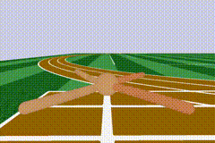
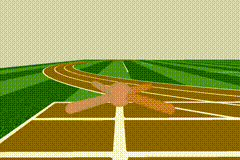
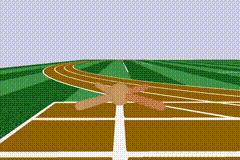
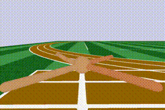

# MULTIPOLAR: <br/> Multi-Source Policy Aggregation for Transfer Reinforcement Learning between Diverse Environmental Dynamics (IJCAI 2020)

This is the original repository for the following paper: 

[Mohammadamin Barekatain](http://barekatain.me), [Ryo Yonetani](https://yonetaniryo.github.io), [Masashi Hamaya](https://sites.google.com/view/masashihamaya/home). "[*MULTIPOLAR: Multi-Source Policy Aggregation for Transfer Reinforcement Learning between Diverse Environmental Dynamics*](https://arxiv.org/pdf/1909.13111.pdf)". To apprear in IJCAI 2020. 


# TL;DR
We propose MULTIPOLAR, a transfer RL method that leverages a set of source policies collected under unknown diverse environmental dynamics to efficiently learn an optimal target policy in another dynamics. [Video of a five-minute presentation of this work.](https://youtu.be/JE5aeTqwo6o)

#### Source agents (Roboschool Ants with different leg designs)
   

#### Target agent trained with MULTIPOLAR (left) vs. trained from scratch (right)
 

# Getting Started

This is a TensorFlow-based implementation to reproduce all of our experiments presented in the paper. All subsequent commands in this README should be run from the top-level directory of this repository. The code has been tested on **Ubuntu 16.04** as well as **Mac OS Mojave 10.14.06**.


# Installation

### Prerequisites
*  python3 (>=3.5) with the development headers.
*  TensorFlow (=1.14.0)

### Ubuntu
```
sudo apt-get update && apt-get install ssh swig cmake libopenmpi-dev python3-dev zlib1g-dev ffmpeg parallel libpcre3-dev libsm6 libxext6 libxrender-dev
```
### Mac OS X

```
brew install cmake openmpi ffmpeg parallel
```

### Install using pip

```
pip install stable-baselines==2.4.0 box2d box2d-kengz pyyaml pybullet==2.1.0 box2d-py gym==0.10.9 roboschool==1.0.46 pytablewriter bootstrapped opencv-python PyYAML==5.1.2
```

Make sure that `gym` version is correct: `gym==0.10.9`. 
Please see [Stable Baselines README](https://github.com/hill-a/stable-baselines) 
and [Rl baseline zoo](https://github.com/araffin/rl-baselines-zoo) for alternative installations.

If you're using Mac OS and have problem installing `pybullet`, use the following:

```
CFLAGS='-stdlib=libc++' pip install pybullet==2.1.0
```

### Testing the installations

To test the installations, first install `pytest`, and then:
```
python -m pytest -v tests/
```


# Training MULTIPOLAR in Acrobot

In this section, we present how to train MULTIPOLAR in Acrobot environment. Since our full experiments are computationally expensive, here we use 10 environment instances instead of 100 for both the baseline and MULTIPOLAR agents. Below commands will execute 3 trainings in parallel. This number must be configured based on the available number of CPUs.

1. Train the baseline agents with multi-layer perceptron (MLP) policy network three times (with different random seeds) in 10 randomly sampled environment instances. 

```
python random_env_dynamic_train_cmd_gen.py --num-samples 10 --algo ppo2 --seed 0 --env Acrobot-v1 \
--params-ranges LINK_LENGTH_1,0.3,1.3 LINK_LENGTH_2,0.3,1.3 LINK_MASS_1,0.5,1.5 LINK_MASS_2,0.5,1.5 LINK_COM_POS_1,0.05,0.95 LINK_COM_POS_2,0.05,0.95 LINK_MOI,0.25,1.5

parallel -a /tmp/out.txt --eta -j 3
```

We also use these trained MLPs as a pool of source policy candidates from which we sample to train MULTIPOLAR policies. Using the `Source_histogram.ipynb` notebook, it's possible to visualize the histogram of final episodic reward (average rewards of the last 100 training episodes) for these candidates similar to the Figure 4 in the paper.

2. For each environment instance, train 3 MULTIPOLAR policies with distinct sets of source policies of size 4 selected randomly from the pool of source policy candidates.

```
python train_multipolar_random_source.py --num-jobs 3 --sources-dir logs/ppo2/ --env Acrobot-v1 \
--algo multipolar-ppo2 --num-set 3 --num-sources 4 --num-subopt-sources 0 --num-samples 10 \
--params-ranges LINK_LENGTH_1,0.3,1.3 LINK_LENGTH_2,0.3,1.3 LINK_MASS_1,0.5,1.5 LINK_MASS_2,0.5,1.5 LINK_COM_POS_1,0.05,0.95 LINK_COM_POS_2,0.05,0.95 LINK_MOI,0.25,1.5
```

3. Repeat *step 2* with one source policy as `RPL` baseline policy.

```
python train_multipolar_random_source.py --num-jobs 3 --sources-dir logs/ppo2/ --env Acrobot-v1 \
--algo multipolar-ppo2 --num-set 3 --num-sources 1 --num-subopt-sources 0 --num-samples 10 \
--params-ranges LINK_LENGTH_1,0.3,1.3 LINK_LENGTH_2,0.3,1.3 LINK_MASS_1,0.5,1.5 LINK_MASS_2,0.5,1.5 LINK_COM_POS_1,0.05,0.95 LINK_COM_POS_2,0.05,0.95 LINK_MOI,0.25,1.5
```

4. Using `Sampling_efficiency.ipynb`, compare the sample efficiency of MULTIPOLAR(K=4) to the baselines similar to Table 7 in the paper.

5. Using `plot_learning_curves.ipynb`, plot the learning curves similar to Figure 3 in the paper.

# Training MULTIPOLAR in other environments

Below you can find the commands we used for performing our other experiments in 100 environment instance.

a) **Roboschool Hopper**

```
python random_env_dynamic_train_cmd_gen.py --num-samples 100 --algo ppo2 --seed 0 --env RoboschoolHopper-v1 \
--params-ranges leg_length,0.35,0.65 foot_length,0.29,0.49 thigh_length,0.35,0.55 torso_length,0.3,0.5 size,0.7,1.1 damping,0.5,4 friction,0.5,2 armature,0.5,2

parallel -a /tmp/out.txt --eta -j 40

python train_multipolar_random_source.py --num-jobs 40 --sources-dir logs/ppo2/ --env RoboschoolHopper-v1 \
--algo multipolar-ppo2 --num-set 3 --num-sources 1 --num-subopt-sources 0 \
--params-range leg_length,0.35,0.65 foot_length,0.29,0.49 thigh_length,0.35,0.55 torso_length,0.3,0.5 size,0.7,1.1 damping,0.5,4 friction,0.5,2 armature,0.5,2

python train_multipolar_random_source.py --num-jobs 40 --sources-dir logs/ppo2/ --env RoboschoolHopper-v1 \
--algo multipolar-ppo2 --num-set 3 --num-sources 4 --num-subopt-sources 0 \
--params-range leg_length,0.35,0.65 foot_length,0.29,0.49 thigh_length,0.35,0.55 torso_length,0.3,0.5 size,0.7,1.1 damping,0.5,4 friction,0.5,2 armature,0.5,2
```


b) **Roboschool Ant**


```
python random_env_dynamic_train_cmd_gen.py --num-samples 100 --algo ppo2 --seed 0 --env RoboschoolAnt-v1 \
--params-range length,0.4,1.4  size,0.7,1.1  damping,0.1,5 friction,0.4,2.5 armature,0.25,3

parallel -a /tmp/out.txt --eta -j 40

python train_multipolar_random_source.py --num-jobs 40 --sources-dir logs/ppo2/ --env RoboschoolAnt-v1 \
--algo multipolar-ppo2 --num-set 3 --num-sources 1 --num-subopt-sources 0 \
--params-range length,0.4,1.4  size,0.7,1.1  damping,0.1,5 friction,0.4,2.5 armature,0.25,3

python train_multipolar_random_source.py --num-jobs 40 --sources-dir logs/ppo2/ --env RoboschoolAnt-v1 \
--algo multipolar-ppo2 --num-set 3 --num-sources 4 --num-subopt-sources 0 \
--params-range length,0.4,1.4  size,0.7,1.1  damping,0.1,5 friction,0.4,2.5 armature,0.25,3
```


c) **Roboschool InvertedPendulumSwingup**


```
python random_env_dynamic_train_cmd_gen.py --num-samples 100 --algo ppo2 --seed 0 --env RoboschoolInvertedPendulumSwingup-v1 \
--params-range length,0.2,2  size,0.4,3  damping,0.1,5 friction,0.5,2 armature,0.5,3 gravity,-11,-7

parallel -a /tmp/out.txt --eta -j 40

python train_multipolar_random_source.py --num-jobs 40 --sources-dir logs/ppo2/ --env RoboschoolInvertedPendulumSwingup-v1 \
--algo multipolar-ppo2 --num-set 3 --num-sources 1 --num-subopt-sources 0 \
--params-range length,0.2,2  size,0.4,3  damping,0.1,5 friction,0.5,2 armature,0.5,3 gravity,-11,-7

python train_multipolar_random_source.py --num-jobs 40 --sources-dir logs/ppo2/ --env RoboschoolInvertedPendulumSwingup-v1 \
--algo multipolar-ppo2 --num-set 3 --num-sources 4 --num-subopt-sources 0 \
--params-range length,0.2,2  size,0.4,3  damping,0.1,5 friction,0.5,2 armature,0.5,3 gravity,-11,-7
```


d) **CartPole**


```
python random_env_dynamic_train_cmd_gen.py --num-samples 100 --algo ppo2 --seed 0 --env CartPole-v1 \
--params-range masscart,0.2,20 masspole,0.1,5 length,0.1,3 force_mag,6,13 gravity,6,14

parallel -a /tmp/out.txt --eta -j 40

python train_multipolar_random_source.py --num-jobs 40 --sources-dir logs/ppo2/ --env CartPole-v1 \
--algo multipolar-ppo2 --num-set 3 --num-sources 1 --num-subopt-sources 0 \
--params-range masscart,0.2,20 masspole,0.1,5 length,0.1,3 force_mag,6,13 gravity,6,14

python train_multipolar_random_source.py --num-jobs 40 --sources-dir logs/ppo2/ --env CartPole-v1 \
--algo multipolar-ppo2 --num-set 3 --num-sources 4 --num-subopt-sources 0 \
--params-range masscart,0.2,20 masspole,0.1,5 length,0.1,3 force_mag,6,13 gravity,6,14
```


e) **LunarLanderContinuous**


```
python random_env_dynamic_train_cmd_gen.py --num-samples 100 --algo sac --seed 0 --env LunarLanderContinuous-v2 \
--params-ranges MAIN_ENGINE_POWER,10,40 SIDE_ENGINE_POWER,0.5,2 SCALE,25,50 INITIAL_RANDOM,500,1500 SIDE_ENGINE_HEIGHT,10,20 SIDE_ENGINE_AWAY,8,18

parallel -a /tmp/out.txt --eta -j 40

python train_multipolar_random_source.py --num-jobs 40 --sources-dir logs/sac/ --env LunarLanderContinuous-v2 \
--algo multipolar-sac --num-set 3 --num-sources 1 --num-subopt-sources 0 \
--params-ranges MAIN_ENGINE_POWER,10,40 SIDE_ENGINE_POWER,0.5,2 SCALE,25,50 INITIAL_RANDOM,500,1500 SIDE_ENGINE_HEIGHT,10,20 SIDE_ENGINE_AWAY,8,18

python train_multipolar_random_source.py --num-jobs 40 --sources-dir logs/sac/ --env LunarLanderContinuous-v2 \
--algo multipolar-sac --num-set 3 --num-sources 4 --num-subopt-sources 0 \
--params-ranges MAIN_ENGINE_POWER,10,40 SIDE_ENGINE_POWER,0.5,2 SCALE,25,50 INITIAL_RANDOM,500,1500 SIDE_ENGINE_HEIGHT,10,20 SIDE_ENGINE_AWAY,8,18
```

# Ablation Study of MULTIPOLAR

There exist two degraded versions of MULTIPOLAR, which is explained in Section 4.2 of the paper.

1. *aggregation parameters fixed to 1*: repeat the training commands with an extra flag `--SIW False`

2. *auxiliary network learned independent of the states*: repeat the training commands with an extra flag `--no-bias True`

